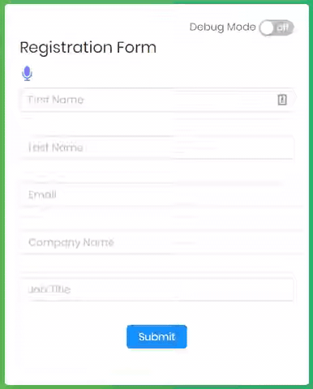

Simple HTML form which can be operated using voice only commands using HTML5 SpeechRecognition api.

## How It works

Click on audio icon to start speech recognition, You can activate/focus any input based on the triggers specified in the [form.json](https://github.com/amitpatil321/VoiceForm/blob/master/src/form.json) file. 

There are few custom commands to operate this form

### Custom Commands

| Command | Description |
|--|--|
| `toggle debug` | Turns on/off debug mode |
| `clear` `clear input` `clear field` `start again` | Turns on/off debug mode  |
|`reset` `reset form` `clear form` | Resets the form by clearing all the inputs|
|`go` `submit` `submit form` | Submits the form |
|`stop recording` `stop listening` | Stops audio recording|  
|`space`| Adds space at the end of active input|
|`undo`| Removed recently added string from currently active input|

## Demo

## How to Run
1) git clone
2) npm install
3) npm start
